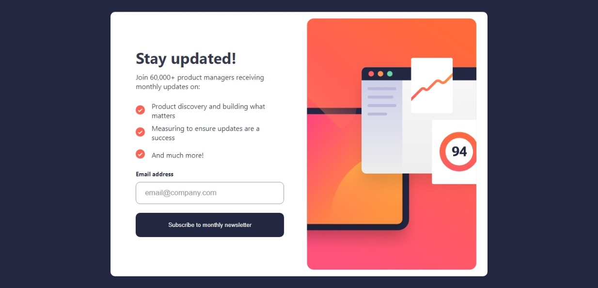
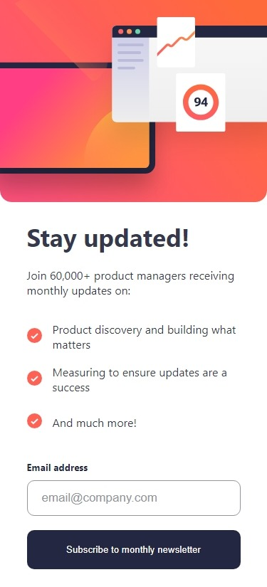

# Frontend Mentor - Newsletter sign-up form with success message solution

This is a solution to the [Newsletter sign-up form with success message challenge on Frontend Mentor](https://www.frontendmentor.io/challenges/newsletter-signup-form-with-success-message-3FC1AZbNrv). Frontend Mentor challenges help you improve your coding skills by building realistic projects. 

## Table of contents
- [Frontend Mentor - Newsletter sign-up form with success message solution](#frontend-mentor---newsletter-sign-up-form-with-success-message-solution)
  - [Table of contents](#table-of-contents)
  - [Overview](#overview)
    - [Screenshot](#screenshot)
    - [The challenge](#the-challenge)
    - [Links](#links)
  - [Process](#process)
    - [Tools Used](#tools-used)
  - [Author](#author)
  - [Acknowledgement](#acknowledgement)

## Overview
### Screenshot

### The challenge

Users should be able to:

- Add their email and submit the form
- See a success message with their email after successfully submitting the form
- See form validation messages if:
  - The field is left empty
  - The email address is not formatted correctly
- View the optimal layout for the interface depending on their device's screen size
- See hover and focus states for all interactive elements on the page

### Links
- [Github repository](https://github.com/Emmanuel-Afrifa/newsletter-sign-up-page)
- [Deployed site](https://newsletter-sign-up-sol.netlify.app/)

## Process
### Tools Used
- Semantic HTML5 markup
- CSS
- Flexbox
- Mobile-first workflow
- [React](https://reactjs.org/) - JS library

## Author
- Emmanuel Afrifa
- [emmaquame9@gmail.com](mailto:emmaquame9@gmail.com)
- [Frontend-Mentor](https://www.frontendmentor.io/profile/Emmanuel-Afrifa)
- [Twitter](https://twitter.com/Emma33712365)
- [Linkedin](https://www.linkedin.com/in/emmanuel-afrifa-840674214/)

## Acknowledgement
- [Frontend Mentor](https://www.frontendmentor.io/)
- [FreeCodeCamp Responsive Web Design](https://www.freecodecamp.org/learn/responsive-web-design/)
